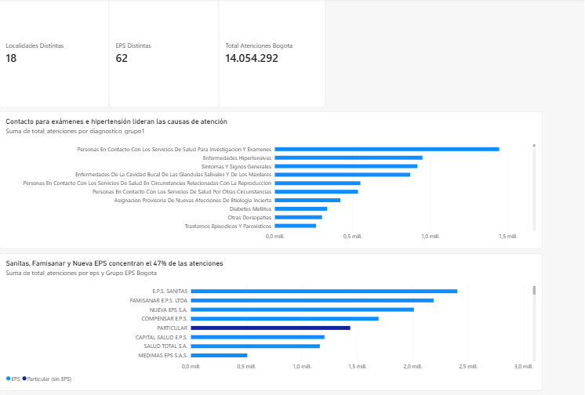
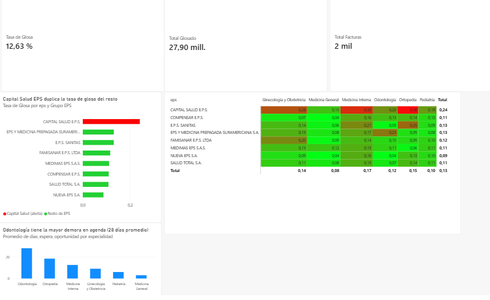

# Red de Salud Vital — Diagnóstico Operativo de una IPS

Red de Salud Vital está perdiendo tiempo y dinero con Capital Salud EPS,
mientras los pacientes esperan semanas por una cita. Este proyecto investiga
ambos problemas con datos: cuánto se está perdiendo en facturación rechazada,
con qué EPS y en qué especialidades se concentra, y por qué la demora en
agendar citas varía tanto entre especialidades.

El análisis combina un dataset público real (morbilidad atendida en Bogotá)
con datos sintéticos de operación interna, diseñados para simular el ciclo
completo de una IPS: pacientes, citas, atenciones y facturación.

## Hallazgos principales

1. **Capital Salud EPS duplica la tasa de glosa (rechazo de facturación) del
   resto de aseguradoras**: 24.09% vs. 8.7%-13.1% en las demás. La diferencia
   se validó estadísticamente con una prueba de chi-cuadrado de independencia
   (χ² = 32.27, p = 0.000036) — no es una diferencia atribuible al azar.
2. **El problema se concentra en las especialidades de mayor costo**: dentro
   de Capital Salud, Ortopedia (37.8%) y Medicina Interna (33.3%) tienen las
   tasas de glosa más altas, consistente con mayor escrutinio de la
   aseguradora en atenciones de alto valor.
3. **Odontología tiene la mayor demora en agenda**: 28 días de espera
   promedio, muy por encima de Medicina General (3 días).
4. **Contexto real de Bogotá (2020)**: sobre 14 millones de atenciones
   registradas en RIPS, casi 1 de cada 5 corresponde a contacto preventivo
   o administrativo con el sistema de salud (exámenes, control de
   reproducción), no a una enfermedad puntual.

Detalle completo, metodología y limitaciones en [`docs/hallazgos_ips.md`](docs/hallazgos_ips.md).

## Arquitectura

```
Capa 1 (real)                          Capa 2 (sintética)
Datos Abiertos Bogotá (RIPS 2020) ─┐    Generador Python (faker) ─┐
        │                          │            │                 │
        ▼                          │            ▼                 │
   Limpieza (encoding)             │      pacientes / citas /      │
        │                          │      atenciones / glosas      │
        ▼                          ▼            │                 │
        └──────────► BigQuery (ips_red_salud) ◄─┘
                              │
                              ▼
                        Power BI (2 páginas)
```

## Capturas del dashboard

**Página 1 — Panorama de Bogotá** (contexto epidemiológico real)



**Página 2 — Operación y Glosas** (hallazgo principal)



## Stack técnico

- **SQL** (Google BigQuery) — modelado, limpieza, agregaciones, window functions
- **Python** (pandas, faker, scipy) — generación de datos sintéticos, prueba de hipótesis (chi-cuadrado)
- **Power BI Desktop** — modelado de relaciones, medidas DAX, dashboard de 2 páginas
- **Git/GitHub** — control de versiones

## Cómo reproducirlo

```bash
# 1. Generar los datos sintéticos de operación
pip install faker pandas numpy
python generate_datos_ips.py

# 2. Cargar todo a BigQuery (requiere gcloud auth application-default login)
pip install google-cloud-bigquery pyarrow db-dtypes
python cargar_morbilidad_real.py
python cargar_operacion_ips.py

# 3. Abrir dashboard/red_salud_vital_dashboard.pbix en Power BI Desktop
```

## Limitaciones conocidas

- El dataset de morbilidad real corresponde únicamente al año 2020 (no hay
  serie de tiempo multi-año en el alcance actual).
- Los patrones de oportunidad de citas y tasa de glosa por EPS en la Capa 2
  fueron parcialmente diseñados en el generador, informados por conocimiento
  real del sistema de salud colombiano — no son un hallazgo emergente de un
  dataset neutral. La interacción específica entre EPS, especialidad y
  motivo de glosa sí es un resultado no calculado de antemano.
- Detalle completo de limitaciones en [`docs/hallazgos_ips.md`](docs/hallazgos_ips.md).
